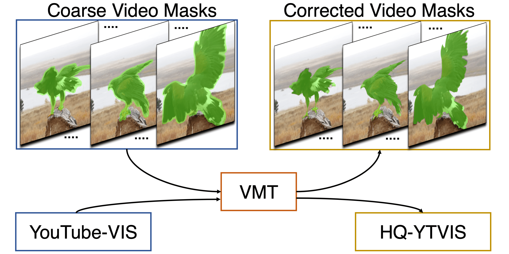

# Video Mask Transfiner
Video Mask Transfiner for High-Quality Video Instance Segmentation [ECCV 2022]

[[Project Page](https://www.vis.xyz/pub/vmt/) | [Dataset Page](https://www.vis.xyz/data/hqvis/) | [Paper](https://arxiv.org/abs/2207.14012)\]

> [**Video Mask Transfiner for High-Quality Video Instance Segmentation**](http://arxiv.org/abs/2207.14012),               
> Lei Ke, Henghui Ding, Martin Danelljan, Yu-Wing Tai, Chi-Keung Tang, Fisher Yu             
> *ECCV 2022 ([arXiv 2207.14012](https://arxiv.org/abs/2207.14012))*         

<p align="center">  </p>

## HQ-YTVIS: High-Quality Video Instance Segmentation Dataset
Mask annotation comparison between **Youtube-VIS** and **HQ-YTVIS**. HQ-YTVIS serves as a new benchmark to facilitate future development (training & evaluation) of VIS methods aiming at higher mask quality.

<!--  -->

https://user-images.githubusercontent.com/17427852/181796696-bfe9a9dd-2d39-42a2-b218-283c210e5ffd.mp4

Mask annotations in **Youtube-VIS** (Left Video) vs. Mask annotations in **HQ-YTVIS** (Right Video). Please visit our [Dataset Page](https://www.vis.xyz/data/hqvis/) for detailed descriptions of using HQ-YTVIS benchmark.

**Dataset Download:** [HQ-YTVIS Annotation Link](https://drive.google.com/drive/folders/1ZU8_qO8HnJ_-vvxIAn8-_kJ4xtOdkefh?usp=sharing)\
**Dataset Usage:** replace our annotation json to original YTVIS annotation files.

## HQ-YTVIS Evaluation API
Please refer to our [Installation Guidance](cocoapi_hq/) and [Tube-Mask AP & Tube-Boundary AP Usage Example](eval_hqvis.py).

```
python eval_hqvis.py --save-path prediction_results.json
```

## VMT Code
<!--  -->

https://user-images.githubusercontent.com/17427852/181796768-3e79ee74-2465-4af8-ba89-b5c837098e00.mp4

Code for VMT is coming soon (before ECCV happens).

## Citation

```bibtex
@inproceedings{vmt,
    title = {Video Mask Transfiner for High-Quality Video Instance Segmentation},
    author = {Ke, Lei and Ding, Henghui and Danelljan, Martin and Tai, Yu-Wing and Tang, Chi-Keung and Yu, Fisher},
    booktitle = {European Conference on Computer Vision (ECCV)},
    year = {2022}
}
```

## Acknowledgement
This repo is based on [Mask Transfiner](https://github.com/SysCV/transfiner) and [SeqFormer](https://github.com/wjf5203/SeqFormer).
