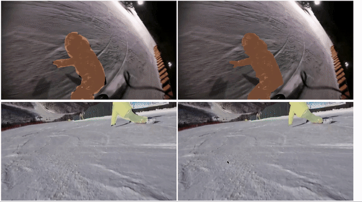

# Video Mask Transfiner for High-Quality Video Instance Segmentation [ECCV 2022]

## HQ-YTVIS: High-Quality Video Instance Segmentation Dataset
**Youtube-VIS** (Left) vs. **HQ-YTVIS** (Right)

Please visit our dataset website for detailed descriptions of using HQ-YTVIS benchmark.

## HQ-YTVIS Evaluation API
xxxxx

## VMT Code

### Train
xxxxx

### Test
xxxx

## Citation

```bibtex
@inproceedings{vmt,
    title = {Video Mask Transfiner for High-Quality Video Instance Segmentation},
    author = {Ke, Lei and Ding, Henghui and Danelljan, Martin and Tai, Yu-Wing and Tang, Chi-Keung and Yu, Fisher},
    booktitle = {European Conference on Computer Vision (ECCV)},
    year = {2022}
}
