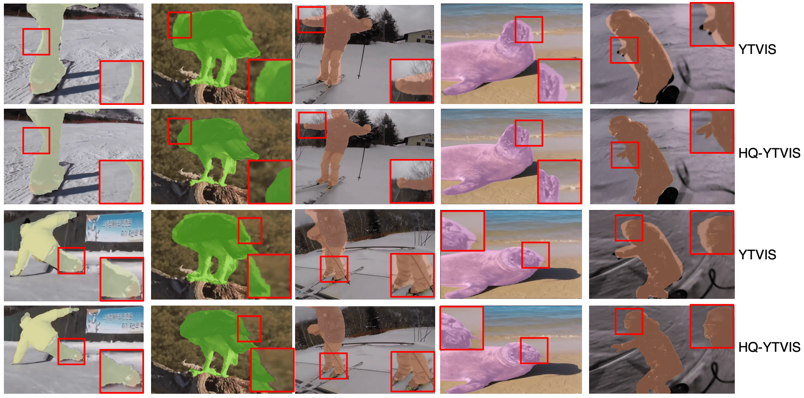

# Video Mask Transfiner for High-Quality Video Instance Segmentation [ECCV 2022]

## HQ-YTVIS: High-Quality Video Instance Segmentation Dataset
Mask annotation comparison between **Youtube-VIS** and **HQ-YTVIS**. HQ-YTVIS serves as a new benchmark to facilitate future development (training & evaluation) of VIS methods aiming at higher mask quality.


Mask annotations in **Youtube-VIS** (Left Video) vs. Mask annotations in **HQ-YTVIS** (Right Video). Please visit our dataset website for detailed descriptions of using HQ-YTVIS benchmark.

[Dataset Downloading Link](https://drive.google.com/drive/folders/1ZU8_qO8HnJ_-vvxIAn8-_kJ4xtOdkefh?usp=sharing)

## HQ-YTVIS Evaluation API
Please refer to our [Installation Guidance](cocoapi_hq/) and [Tube-Mask AP & Tube-Boundary AP Usage Example](eval_hqvis.py).

```
python eval_hqvis.py --save-path prediction_results.json
```

## VMT Code


### Train
TBD

### Test
TBD

## Citation

```bibtex
@inproceedings{vmt,
    title = {Video Mask Transfiner for High-Quality Video Instance Segmentation},
    author = {Ke, Lei and Ding, Henghui and Danelljan, Martin and Tai, Yu-Wing and Tang, Chi-Keung and Yu, Fisher},
    booktitle = {European Conference on Computer Vision (ECCV)},
    year = {2022}
}
```

## Acknowledgement
This repo is based on [Mask Transfiner](https://github.com/SysCV/transfiner) and [SeqFormer](https://github.com/wjf5203/SeqFormer).
